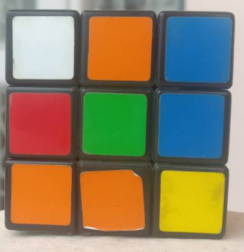
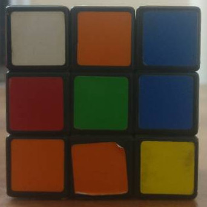

# OpenCV-Training-Image-Colorspaces

Image colorspaces using OpenCV.
## Contents :
I have used the following functions/methods:

| Function        |Action                                                                        |
|----------------:|------------------------------------------------------------------------------|
|cv2.resize()     |We resize an image given a specific scale factor both on X and Y axis         |
|cv2.cvtColor()   |We convert color by specifying destination colorspace                         |

## Test Image used: 
I have used cube1.jpg & cube8.jpg that can be found in the repository.




## Summary:

```python
#We convert from BGR to LAB (bright)
brightLAB = cv2.cvtColor(scaled_bright,cv2.COLOR_BGR2LAB)
#We convert from BGR to LAB (dark)
darkLAB = cv2.cvtColor(dark,cv2.COLOR_BGR2LAB)
```
```python
#WE convert from BGR to YCrCb
brightYCB = cv2.cvtColor(scaled_bright,cv2.COLOR_BGR2YCR_CB)
darkYCB = cv2.cvtColor(dark,cv2.COLOR_BGR2YCR_CB)
```
```python
#WE convert to HSV color space
brightHSV = cv2.cvtColor(scaled_bright,cv2.COLOR_BGR2HSV)
darkHSV = cv2.cvtColor(dark,cv2.COLOR_BGR2HSV)
```

